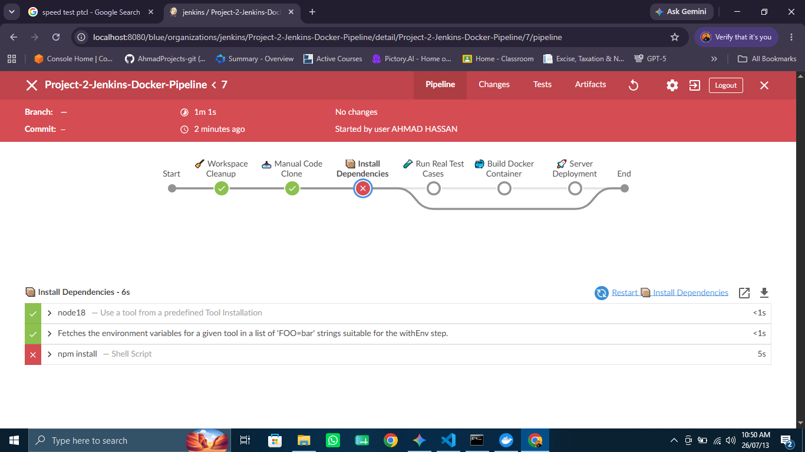
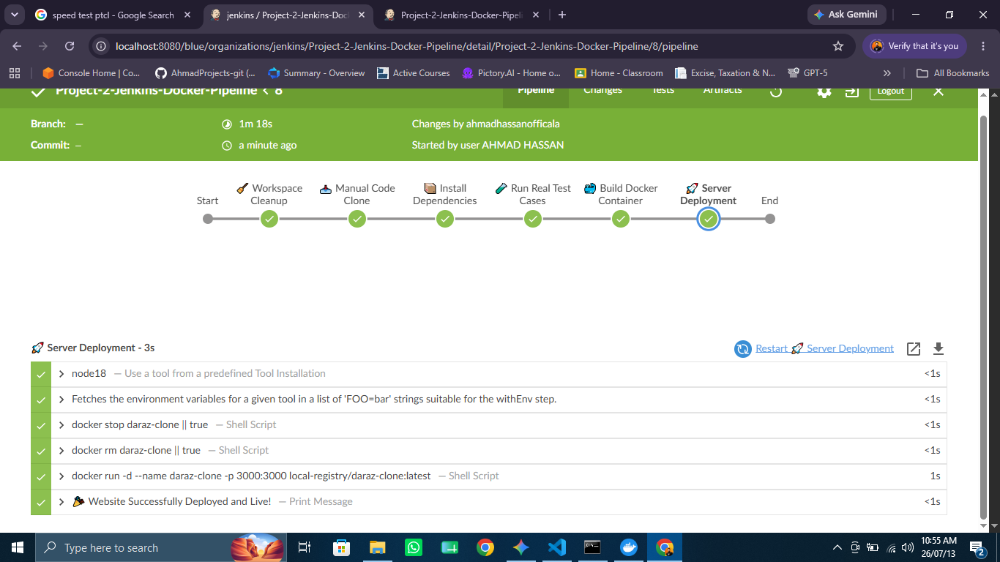

# Project-2-Jenkins-Docker-Pipeline

## 📖 Overview
This project demonstrates an **Enterprise-Grade CI/CD Pipeline** designed to automate the lifecycle of a Node.js web application. It transitions from source code management to automated testing and containerized production deployment using Jenkins and Docker.

### Key Objectives
*   **Automation:** Automate repetitive manual deployment tasks using a declarative Jenkins pipeline.
*   **Validation:** Ensure code quality through automated unit testing using Mocha and Supertest.
*   **Containerization:** Achieve environment consistency by packaging the application into a Docker container.
*   **Resilience:** Implement "Docker-out-of-Docker" (DooD) to allow Jenkins to manage host-level container lifecycles safely.

---

## 🛠 Tech Stack
*   **CI/CD:** Jenkins (Declarative Pipeline)
*   **Runtime:** Node.js (v18)
*   **Testing:** Mocha, Supertest
*   **Orchestration:** Docker
*   **Deployment Environment:** Linux/WSL

---

## 🚀 Step-by-Step Setup Guide

### 1. Initialize Jenkins with Docker Socket
To enable Jenkins to build images on the host, run the container with socket volume mapping:

```bash
docker run -d --name jenkins-server \
  -p 8080:8080 -p 50000:50000 \
  -v jenkins_home:/var/jenkins_home \
  -v /var/run/docker.sock:/var/run/docker.sock \
  -u root --restart unless-stopped jenkins/jenkins:lts

```

### 2. Configure Tools

1. **Plugins:** Install **NodeJS Plugin** via *Manage Jenkins > Plugins*.
2. **Tools:** Configure NodeJS under *Manage Jenkins > Tools*. Set **Name** to `node18`, choose **Version** `18.x.x`, and check **Install Automatically**.

### 3. Pipeline Implementation

Use the following Declarative Pipeline script in your Jenkins job configuration:

```groovy
pipeline {
    agent any
    tools { nodejs 'node18' }
    stages {
        stage('Cleanup') { steps { cleanWs() } }
        stage('Clone') { steps { git branch: 'main', url: '[https://github.com/AhmadProjects-git/Project-2-Jenkins-Docker-Pipeline.git](https://github.com/AhmadProjects-git/Project-2-Jenkins-Docker-Pipeline.git)' } }
        stage('Install') { steps { sh 'npm install' } }
        stage('Test') { steps { sh 'npm test' } }
        stage('Build') { steps { sh 'docker build -t daraz-clone .' } }
        stage('Deploy') { steps { 
            sh "docker stop daraz-clone || true"
            sh "docker rm daraz-clone || true"
            sh "docker run -d --name daraz-clone -p 3000:3000 daraz-clone:latest"
        }}
    }
}

```

---

## 📈 Pipeline Lifecycle History

### 🛑 Iteration 1: Initial Failure (Dependency Parsing Error)


### ✅ Iteration 2: Enterprise Integration Success
After resolving dependency issues and adding an `after()` hook in the Mocha test suite to properly terminate the server process, the pipeline achieved full lifecycle success.

During the initial staging run, the pipeline crashed at the `Install` stage. This was caused by an empty `package.json` file, demonstrating the necessity of schema validation in automated builds.

---

## 💡 Lessons Learned

* **Environment Parity:** Ensure local and container environments have synchronized dependency versions.
* **Process Management:** Automated testing environments require explicit termination commands (`process.exit(0)`) to prevent CI/CD pipeline hangs.
* **Infrastructure as Code:** Using a `Jenkinsfile` provides a version-controlled and reproducible deployment strategy.

---

*Maintained by Ahmad Hassan - DevOps Engineer*
